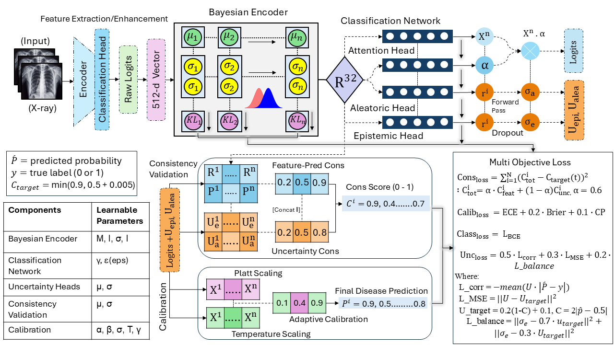

# Bayesian Modelling for Enhanced Uncertainty, Consistency, and Calibration in Multi-Disease Chest X-ray Diagnosis

<p align="center">
  
</p>

---

## Highlights

- **Hierarchical Bayesian Architecture** with attention-weighted multi-scale feature extraction for comprehensive uncertainty quantification  
- **Dual Uncertainty Decomposition** separating epistemic (model uncertainty) and aleatoric (data uncertainty) for interpretable predictions  
- **Multi-Agent System** with specialized agents for disease classification, consistency validation, and adaptive calibration  
- **State-of-the-art Performance** achieving *86.1% AUC* on CheXpert with exceptional calibration *(ECE < 0.02)*  
- **Clinically Interpretable uncertainty estimates** that enable safer deployment in medical decision support systems  

---

## Abstract

This repository contains the implementation of our **Enhanced Bayesian Framework** for uncertainty-aware chest X-ray classification.  

Our approach addresses the critical need for **reliable uncertainty quantification in medical AI** by combining:  

- **Bayesian Classification**  
- **Uncertainty Quantification**  
- **Consistency Validation**  
- **Adaptive Calibration**  

**Key Innovation**: Unlike traditional deep learning models that output point predictions, our framework provides *accurate predictions with uncertainty estimates* that help clinicians understand **when the model is uncertain and why** — crucial for high-stakes medical decisions.

---

## Architecture Overview

Our framework consists of four main components:

1. **Hierarchical Bayesian Encoder**: Multi-scale feature extraction with variational layers  
2. **Disease Classification Agent**: Bayesian classifier with uncertainty quantification  
3. **Consistency Validation Agent**: Cross-validation of predictions and uncertainties  
4. **Adaptive Calibration Module**: Dynamic temperature and Platt scaling  

---

## Repository Structure

├── Configuration/
│ └── model_configuration.json # Model configuration
├── Data Pre-processing/
│ └── data_pre-processing.py # Data cleaning & preprocessing
├── Evaluation Metrics/
│ └── evaluation_metrics_calculator.py # Custom evaluation metrics
├── Figures/ # Figures for framework & uncertainty
├── Model/
│ ├── bayesianencoder.py # Hierarchical Bayesian encoder
│ ├── calibration.py # Adaptive calibration
│ ├── classification_network.py # Disease classification agent
│ ├── consistency_validation.py # Consistency validation agent
│ ├── enhanced_bayesian_framework.py # Full model integration
│ ├── multi-objective_loss.py # Multi-objective loss
│ └── variationallinear.py # Variational linear layers
├── main.py # Entry point for training/testing
├── requirements.yml # Environment dependencies
└── README.md # Project documentation

---

## Quick Start

### Installation

```bash
# Clone repository
git clone https://github.com/dawoodrehman44/ICASSP-2026.git
cd ICASSP-2026

# Create environment
conda create -n bayesian_med python=3.8
conda activate bayesian_med

# Install dependencies
pip install -r requirements.txt

---
## Training
# Train the Enhanced Bayesian Framework
python training/train.py \
    --config configs/training_config.json \
    --data_path /path/to/chexpert \
    --epochs 300 \
    --batch_size 32

---
## Testing
# Generate comprehensive uncertainty analysis
python Evaluation\ Metrics/evaluation_metrics_calculator.py \
    --checkpoint checkpoints/model_epoch_285.pt \
    --data_path /path/to/validation \
    --mc_samples 1000

---
## Contact
For questions or collaborations, please contact: 
Dawood Rehman – [dawoodrehman1297@gapp.nthu.edu.tw]